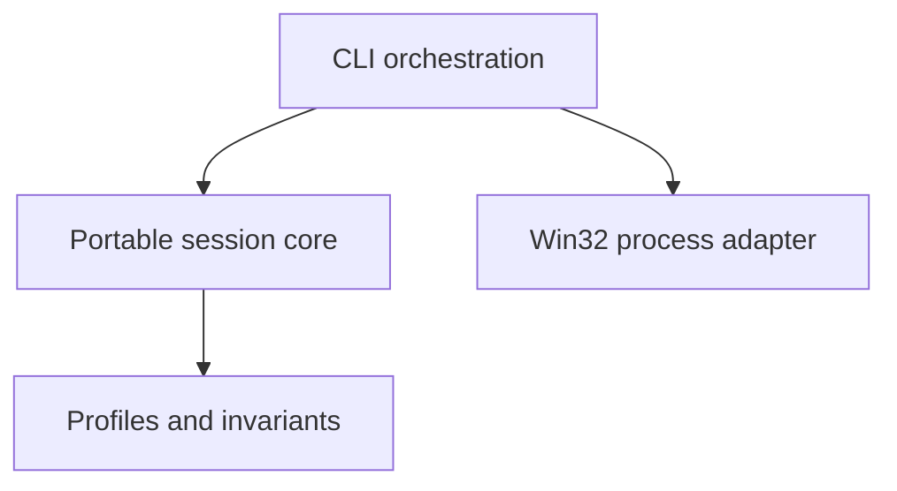

# GhostClock

More performance. No extra MHz.

Windows performance orchestration without overclocking.

GhostClock observes a target process and can apply a small, reversible scheduling change for the lifetime of a performance session. It does not change CPU or GPU clocks, voltages, firmware, or BIOS settings.

## Why GhostClock

Overclocking raises hardware operating frequencies. GhostClock works at the operating-system layer instead:

- process scheduling;
- resource allocation;
- background interference analysis;
- power policy, when a future implementation can justify and restore it;
- workload observation.

The current MVP changes only process priority. It collects a baseline first, never selects the realtime priority class, and records the rollback result.

## Principles

- No overclocking
- No voltage changes
- No placebo tweaks
- Reversible changes
- Evidence-driven optimization
- Local-only operation
- Explicit failure instead of silent fallback

## Status

Early development and experimental. Version 0.1.0 is a vertical slice for process discovery, metrics, session state, priority changes, dry-run, and rollback.

## Architecture



The portable core owns session state and policy decisions. The Win32 adapter owns operating-system handles, discovery, metrics, and priority calls. See [docs/architecture.md](docs/architecture.md) for the API inventory, privilege boundaries, risks, and lifecycle.

## Build

Use a Visual Studio 2022 Developer Command Prompt:

```powershell
cmake -S . -B build -G "Visual Studio 17 2022" -A x64
cmake --build build --config Release
ctest --test-dir build -C Release --output-on-failure
```

The executable will be at `build\Release\ghostclock.exe`.

The portable core and its tests can also be built on a non-Windows host. The Windows CLI is omitted there:

```sh
cmake -S . -B build
cmake --build build
ctest --test-dir build --output-on-failure
```

## Usage

Observe one running process without changing it:

```powershell
ghostclock observe notepad.exe
```

Preview the balanced boost plan without changing the process:

```powershell
ghostclock boost notepad.exe --dry-run
```

Run a performance session:

```powershell
ghostclock boost notepad.exe --profile gaming
```

If more than one process has the same executable name, GhostClock stops and prints the candidate PIDs. Select one explicitly:

```powershell
ghostclock boost notepad.exe --pid 14320 --profile balanced
```

The `balanced` and `development` profiles target Above Normal priority. The `gaming` profile targets High priority. A process already running at an equal or higher priority is not changed.

During an active session, press Ctrl+C to stop monitoring and restore the original priority while the target is still running. If the target exits normally, Windows destroys its scheduling state and no priority restoration is necessary.

## Safety

GhostClock opens only the selected process and retains its handle for the entire session, which prevents PID reuse from redirecting an active session. Every Win32 result is checked, all owned handles are closed, and a priority change creates a pending rollback obligation before monitoring begins.

Changing the priority of an elevated, protected, system, or differently owned process can fail with access denied. GhostClock does not request `SeDebugPrivilege` and does not bypass that boundary. High priority can reduce responsiveness under sustained load; Realtime is never selected.

## Roadmap

- 0.1: process discovery, baseline metrics, session model, dry-run, process priority, rollback, CLI
- 0.2: configurable profiles, power policy, process classification, richer metrics
- 0.3: ETW, controlled performance experiments, benchmark framework, reports
- 0.4: background workload orchestration, service mode, IPC
- 1.0: validated stable optimization engine

Planned items are not implemented commands.

## License

MIT. See [LICENSE](LICENSE).
