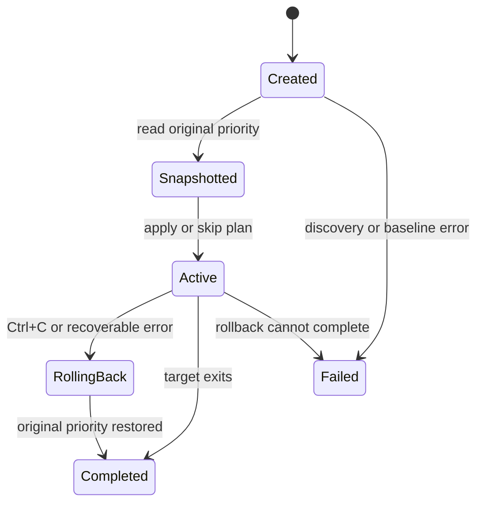

# GhostClock MVP Architecture

## Concept analysis

GhostClock is viable as a Windows performance orchestration and observability tool if every mutation has a narrow scope, a measurable reason, a captured prior state, and a rollback operation. It should not be described as an overclock because it does not change hardware frequency. The useful technical surface is Windows scheduling, process resource observation, power policy, and controlled interference reduction.

The smallest meaningful vertical slice is one target process and one reversible mutation: process priority. This establishes the session, snapshot, metrics, mutation, monitoring, and rollback paths without prematurely adding services, IPC, ETW, affinity policy, process suspension, or persistent configuration.

## Minimal components

| Component | Responsibility | Current implementation |
| --- | --- | --- |
| Portable core | Session state machine, profiles, priority policy, metric calculations | `src/core` |
| Win32 adapter | Process discovery, handle ownership, metrics, priority operations, waiting | `src/platform/windows` |
| CLI | Argument validation, explicit target selection, orchestration, reporting | `src/cli` |
| Tests | State, policy, rollback planning, and metric calculation tests | `tests` |

This separation keeps Win32 calls out of policy code without introducing interfaces that have no second implementation. The core uses fixed-size structures and does not allocate memory dynamically.

## Directory structure

```text
GhostClock/
|-- include/ghostclock/
|   |-- core.h
|   `-- windows.h
|-- src/
|   |-- cli/main.c
|   |-- core/
|   |   |-- core.c
|   |   `-- profile.c
|   `-- platform/windows/windows.c
|-- tests/test_core.c
|-- docs/architecture.md
`-- CMakeLists.txt
```

There are no empty placeholders for future subsystems.

## Win32 API inventory for the MVP

| Concern | APIs | Reason |
| --- | --- | --- |
| Process discovery | `CreateToolhelp32Snapshot`, `Process32FirstW`, `Process32NextW` | Find exact executable-name matches and expose ambiguity |
| Thread count | `CreateToolhelp32Snapshot`, `Thread32First`, `Thread32Next` | Observe current thread count |
| Process access | `OpenProcess`, `CloseHandle` | Hold a stable target object and own its handle explicitly |
| Priority | `GetPriorityClass`, `SetPriorityClass` | Snapshot, apply, and restore the only MVP mutation |
| CPU and lifetime | `GetProcessTimes`, `GetSystemTimeAsFileTime` | Calculate process CPU use between samples and process uptime |
| Memory | `GetProcessMemoryInfo`, `GlobalMemoryStatusEx` | Observe working set, private bytes, and system memory pressure |
| I/O | `GetProcessIoCounters` | Observe cumulative read and write transfer counts |
| Other process state | `GetProcessAffinityMask`, `GetProcessHandleCount` | Report affinity and handle count without changing them |
| Monitoring | `WaitForSingleObject`, `GetExitCodeProcess` | Detect target exit without polling by PID |
| Shutdown handling | `SetConsoleCtrlHandler`, `InterlockedExchange` | Request rollback safely on Ctrl+C |
| Session identity | `GetLocalTime`, `QueryPerformanceCounter` | Produce a readable session identifier with a local uniqueness suffix |
| Text conversion | `MultiByteToWideChar` | Convert UTF-8 CLI input for wide Win32 enumeration |

Every acquired snapshot or process handle has one owner and one matching `CloseHandle` path. The console control handler only sets an atomic flag. It does not call complex Win32 APIs or attempt rollback inside the handler.

## Privilege boundary

Observation normally requires `PROCESS_QUERY_LIMITED_INFORMATION` and `SYNCHRONIZE`. A boost also requests `PROCESS_SET_INFORMATION` for `SetPriorityClass`.

Administrator elevation is not normally required for a process owned by the same user at the same integrity level. Access can be denied for:

- elevated targets when GhostClock is not elevated;
- protected processes;
- system processes;
- processes owned by another user or security context.

The MVP does not enable `SeDebugPrivilege`, install a service, or attempt to bypass access control. It returns an error containing the PID, operation, and Win32 error code.

## Performance Session lifecycle



The concrete sequence is:

1. Resolve exactly one target process.
2. Open and retain a process handle.
3. Create the session ID and collect two pre-change metric samples.
4. Snapshot the priority class.
5. Evaluate the selected profile and record the proposed change.
6. In dry-run mode, report the plan and complete without mutation.
7. Apply the change only if the current priority is lower than the profile target.
8. Mark rollback as pending before monitoring begins.
9. Monitor the retained process handle and collect runtime metrics.
10. On Ctrl+C or a recoverable monitoring error, restore the captured priority while the process is alive.
11. On normal target exit, mark rollback as unnecessary because the process scheduling state no longer exists.
12. Report the final session and rollback states, then close the handle.

## Risks and controls

| Risk | Current control | Remaining limitation |
| --- | --- | --- |
| Wrong process selected | Exact case-insensitive executable match; ambiguity requires `--pid` | PID selection is manual when names collide |
| PID reuse | One retained process handle is used after discovery | None within one session |
| Priority harms responsiveness | No Realtime priority; no downgrade or redundant change | High priority can still affect responsiveness under load |
| Target exits during an operation | Waitable handle and active-state check | Metrics can become unavailable during the exit race |
| Partial failure after mutation | Pending rollback state and centralized cleanup | Process termination can make explicit restoration impossible and unnecessary |
| Rollback fails | Failure is visible and returns a distinct nonzero exit | No persistent recovery journal in 0.1 |
| Elevated or protected target | Access denied is reported; no privilege escalation | User must run at a compatible integrity level if appropriate |
| More than 64 logical processors | Affinity is observation-only and uses the current process-group mask | Processor-group-aware reporting is planned |
| Unsupported claims | Output reports raw metrics and actual actions only | No controlled benchmark framework in 0.1 |

## Memory and error discipline

The MVP uses stack-allocated structures and fixed-size buffers. It performs no direct `malloc` calls. The Win32 process wrapper owns its `HANDLE`; callers close it through `gc_win32_close_process`. Toolhelp snapshots are created and closed within the function that uses them.

Relevant Win32 return values are checked. Failures preserve the operation context and `GetLastError` code. Cleanup is centralized so that mutation and resource release obligations remain visible.

## Implementation stages

1. Portable core and lifecycle tests.
2. Win32 process discovery and explicit handle ownership.
3. Baseline CPU, memory, I/O, thread, handle, uptime, priority, and affinity observation.
4. Dry-run priority plan.
5. Priority mutation, monitoring, Ctrl+C handling, and rollback.
6. Windows build and integration demonstration with an isolated child process.
7. CI validation on Windows and portable-core validation on Linux.

Stages 1 through 5 are implemented in version 0.1.0. The Windows integration test launches an isolated copy of its own test executable, changes its priority from Normal to Above Normal, observes the change, restores Normal, and verifies the restored value. It provides the same scheduling and rollback proof as a `notepad.exe` demonstration without relying on a desktop application in headless CI.

## Deferred work

Power policy, thread priority, affinity changes, background-process classification, suspension, ETW, persistent reports, service mode, IPC, configuration files, and controlled benchmarks are intentionally deferred. Each requires a separate evidence model and rollback design before implementation.
